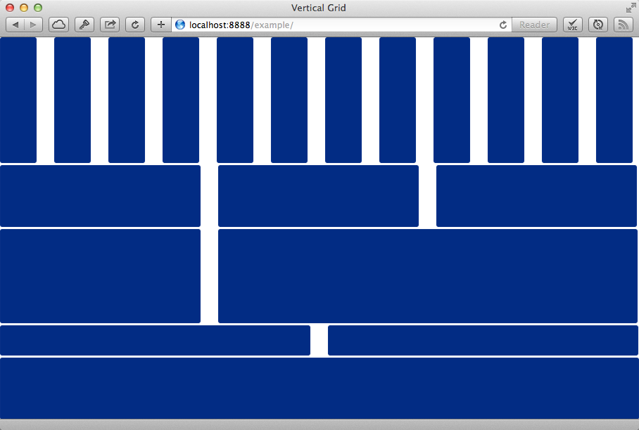

Vertical Grid
=============

A vertical grid css system designed to play nice with Bootstrap.

Take your grid from this:

to this:

Look in the example directory for some sample html code.

Wrap all your elements in an element with `class="container-vertical"`.

Add one of `vertical-span1, vertical-span2, ... vertical-span12` to each of your rows.

Rows can be nested.
